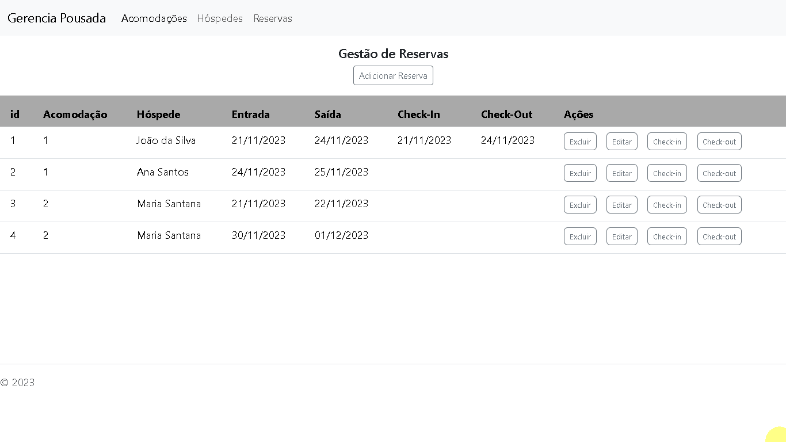

## UNISENAI - Análise e Desenvolvimento de Sistemas 

## PROJETO APLICADO 2 - 2023-2 

- Evando dos Reis Ferreira Alves
- Gabriel Oliveira da Silva
- Jônatas Fred Rossetto
- Lucas José de Paula

# Aplicativo Web para gerenciar as reservas de uma pousada  

Neste documento

- Sobre o aplicativo
- Arquitetura do aplicativo
- Stack
- Instruções para execução
- Telas do aplicativo

## Sobre o aplicativo

O aplicativo foi desenvolvido a partir da demanda da Pousada Quinta do Ypuã (https://www.quintadoypua.com/), registrada na plataforma SAGA SENAI DE INOVAÇÃO pelo link: https://plataforma.gpinovacao.senai.br/plataforma/demandas-da-industria/interna/9790.

## Arquitetura do aplicativo

- O aplicativo é estruturado em três camadas principais, uma camada de front-end, uma camada de back-end e uma camada de persistência. 
- A camada de front-end foi desenvolvida como uma SPA (Single Page Application) utilizando o framework Angular, com NodeJs e TypeScript, o design das telas foi implementado utilizando-se a biblioteca de componentes Bootstrap. O front-end se comunica com a api rest do back-end através de requisições http com autorização concedida por um token JWT fornecido pelo back-end no momento do login. 
- A camada de back-end foi desenvolvida em Java 17 com auxílio do framework SpringBoot para implementação dos end-points REST que implementam as operações do sistema. O Spring Security é utilizado para garantir a autorização de acesso aos end-points através da validadação de um token JWT e configurar o acesso via CORS. O Spring JPA é utilizado para a comunicação com a camada de persistência. O gerenciador de dependências é o Maven. 
- A camada de persistência é implementada com o MySql, um sistema gerenciador de banco de dados relacional. 

## Stack:

### Back-end

- IDE Eclipse >2023-09
- Maven
- Java 17 + Spring Boot 3.1.5
- flyway para migration
- MySql com o Workbench 8.0
- JWT
- Postman

### Front-end

- Node.js 20.9.0
- Angular 16.2.9
- Bootstrap
- TypeScript
- Html / Css

## Instruções para execução do aplicativo

Baixar ou clonar este repositório.

### Back-end

- Utilizando o MySql Workbench, criar o esquema "gerencia_reservas_api" no MySql
- No Eclipse, FILE -> IMPORT -> MAVEN -> EXISTING MAVEN PROJECTS -> BROWSE, selecionar a pasta api do projeto.
- No Eclipse, Na pasta src/main/resources editar o arquivo application.properties, especificamente os campos "spring.datasource.username" e "spring.datasource.password" com o seu username e a sua senha de acesso local ao servidor MySql (configurado na instalação do MySql).
- No Eclipse, no pacote "gerencia.reservas.api" abrir e executar o arquivo "ApiApplication.java" para iniciar o serviço de backend.

### Front-end

- Na pasta frontend, pela linha de comando executar "npm install" para instalar todas as dependências.
- Na pasta frontend, pela linha de comando executar "npm start" para fazer o build do projeto em Angular.
- Pelo navegador, acessar "http://localhost:4200/login".
- Selecionar Signup para registrar um novo usuário
- Fazer login, com os dados cadastrados, para utilizar o sistema

### Swagger - Ambiente de Desenvolvimento

- http://localhost:8080/swagger-ui/index.html#/
- http://localhost:8080/v3/api-docs

### Esquema do Postman para teste dos endpoints

- https://github.com/jonatasrossetto/GerenciaReservas/blob/main/Gerencia_Reservas_API.postman_collection_21-10-2023.json

## Telas

Login

Dashboard

Gerenciar Acomodações

Gerenciar Hóspedes

Gerenciar Reservas

